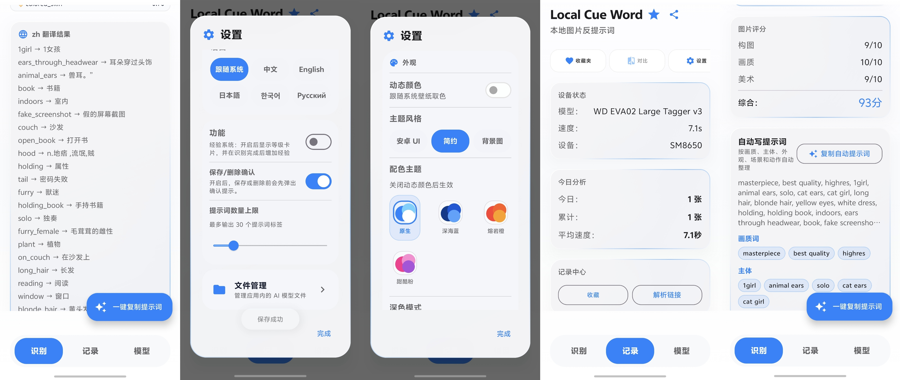

  

<h1 align="center">Local Cue Word</h1>

  手机本地 AI 反推提示词 · 图片标签识别 · 绘画提示词整理

  
  
  
  

  <a href="https://github.com/p8735489-prog/ChuBaichuan-TagAI/releases/latest">下载最新 APK</a>
  ·
  <a href="https://qm.qq.com/q/6jViPcR9le">加入 QQ 群</a>
  ·
  <a href="https://t.me/Local_Cue_Word">加入 Telegram</a>
  ·
  <a href="https://www.ifdian.net/a/cubaicuan">赞助作者</a>

  

## APP 简介

Local Cue Word 是一款 Android 本地 AI 图片反提示词工具。它可以在手机上识别图片内容，生成标签，并自动整理成适合 AI 绘画使用的提示词。

APP 重点放在“选择图片后快速得到可用提示词”。你可以把它当成手机里的提示词整理器，用来分析参考图、整理角色图、提取画面元素、保存常用标签。

## 功能亮点

| 功能 | 说明 |
| --- | --- |
| 本地 AI 识别 | 在手机端运行模型，识别图片中的人物、服饰、动作、场景和画面元素 |
| 自动写提示词 | 自动把识别标签整理成更适合 AI 绘画使用的提示词 |
| 标签翻译 | 支持把标签翻译成中文、日文、韩文、俄文等语言 |
| 多模型切换 | 内置多个 WD Tagger 模型入口，可按效果和速度选择 |
| 历史记录 | 保存识别过的图片和标签，方便回看与再次使用 |
| 收藏功能 | 常用标签可收藏，适合整理角色、风格和构图词库 |
| 批量识别 | 支持一次选择多张图片，连续生成标签结果 |
| 自定义外观 | 支持深色模式、动态配色、自定义背景图、背景调暗和主题颜色 |
| 液态玻璃 | 基于 AndroidLiquidGlass 开源库实现真实物理光学玻璃效果（模糊、折射、色散、菲涅尔反射） |
| 分享入口 | 支持分享提示词、开源地址、QQ群和 Telegram 群 |
| 赞助支持 | 支持通过爱发电赞助作者持续开发 |

## 使用方式

1. 下载并安装 APK。
2. 打开 APP，选择一张图片。
3. 点击识别，等待本地模型生成标签。
4. 查看自动整理好的提示词。
5. 按需复制、翻译、收藏、保存或分享。

## APK 下载

APK 已经放在 GitHub Releases 页面，直接下载最新版本即可安装。

| 下载方式 | 链接 |
| --- | --- |
| 最新版本 | https://github.com/p8735489-prog/ChuBaichuan-TagAI/releases/latest |
| 所有历史版本 | https://github.com/p8735489-prog/ChuBaichuan-TagAI/releases |

## 支持的模型

APP 内置了以下模型入口。不同模型在识别质量、速度和体积上有所区别，可以根据手机性能选择。

| 模型 | 系列 | 体积 | 链接 |
| --- | --- | --- | --- |
| WD EVA02 Large Tagger v3 | WD v3 | ~1.4GB | https://huggingface.co/SmilingWolf/wd-eva02-large-tagger-v3 |
| WD ConvNeXt Tagger v3 | WD v3 | ~377MB | https://huggingface.co/SmilingWolf/wd-convnext-tagger-v3 |
| WD SwinV2 Tagger v3 | WD v3 | ~342MB | https://huggingface.co/SmilingWolf/wd-swinv2-tagger-v3 |
| WD ViT Tagger v3 | WD v3 | ~327MB | https://huggingface.co/SmilingWolf/wd-vit-tagger-v3 |
| WD v1.4 MOAT Tagger v2 | WD v1.4 | ~300MB+ | https://huggingface.co/SmilingWolf/wd-v1-4-moat-tagger-v2 |
| WD v1.4 ConvNeXtV2 Tagger v2 | WD v1.4 | ~300MB+ | https://huggingface.co/SmilingWolf/wd-v1-4-convnextv2-tagger-v2 |
| WD v1.4 ConvNeXt Tagger v2 | WD v1.4 | ~300MB+ | https://huggingface.co/SmilingWolf/wd-v1-4-convnext-tagger-v2 |
| WD v1.4 SwinV2 Tagger v2 | WD v1.4 | ~300MB+ | https://huggingface.co/SmilingWolf/wd-v1-4-swinv2-tagger-v2 |
| WD v1.4 ViT Tagger v2 | WD v1.4 | ~300MB | https://huggingface.co/SmilingWolf/wd-v1-4-vit-tagger-v2 |
| WD v1.4 ViT Tagger | WD v1.4 | ~300MB | https://huggingface.co/SmilingWolf/wd-v1-4-vit-tagger |

## 社区

欢迎加入社区交流使用体验、反馈问题、分享提示词整理方式。

| 平台 | 地址 |
| --- | --- |
| QQ 群 | https://qm.qq.com/q/6jViPcR9le |
| Telegram | https://t.me/Local_Cue_Word |
| 开源地址 | https://github.com/p8735489-prog/ChuBaichuan-TagAI |

## 作者

| 平台 | 链接 |
| --- | --- |
| 抖音 | https://v.douyin.com/cXXYxxK-0nI/ |
| 哔哩哔哩 | https://b23.tv/LCFclCs |
| 快手 | https://v.kuaishou.com/K9Ht7HVJ |

## 赞助

如果这个项目对你有帮助，欢迎赞助支持作者持续开发：

[爱发电赞助页面](https://www.ifdian.net/a/cubaicuan)

## 技术致谢与开源依赖

本 APP 使用了以下开源项目与公开 API，在此表示感谢：

| 项目 / API | 说明 | 地址 |
| --- | --- | --- |
| AndroidLiquidGlass | 液态玻璃效果核心库（AGSL 着色器实现折射、色散、菲涅尔反射） | https://github.com/Kyant0/AndroidLiquidGlass |
| MyMemory Translation API | 标签多语言翻译服务 | https://mymemory.translated.net/doc/spec.php |
| 今日诗词 API | Hero 区随机古诗词副标题 | https://www.jinrishici.com |

## 许可证

本项目开源，欢迎学习交流。
